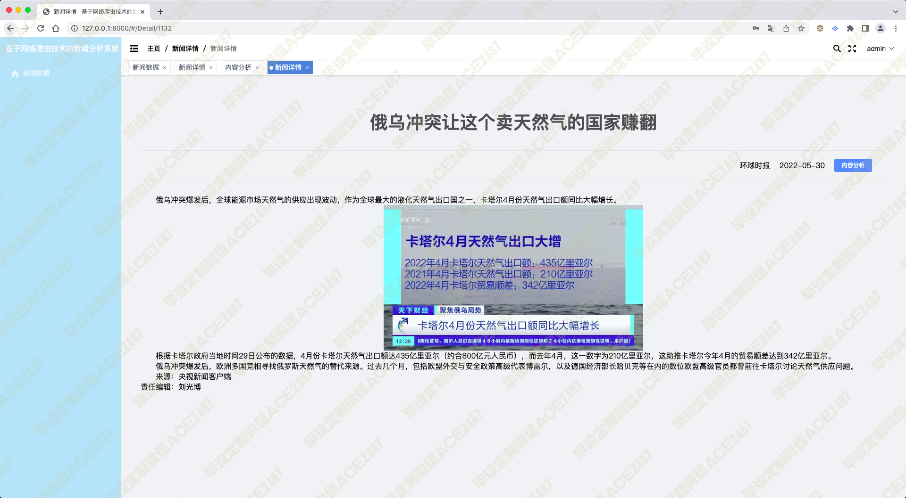
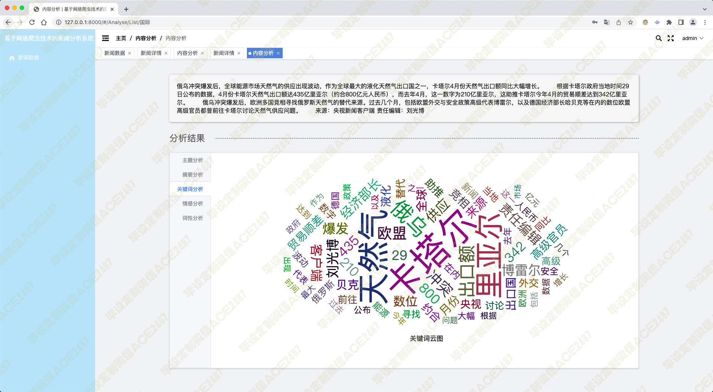
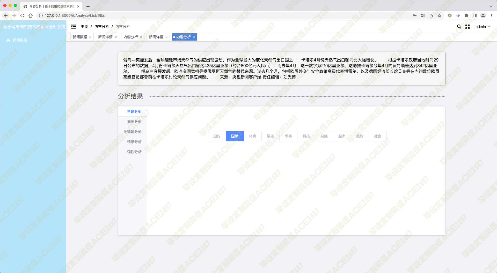
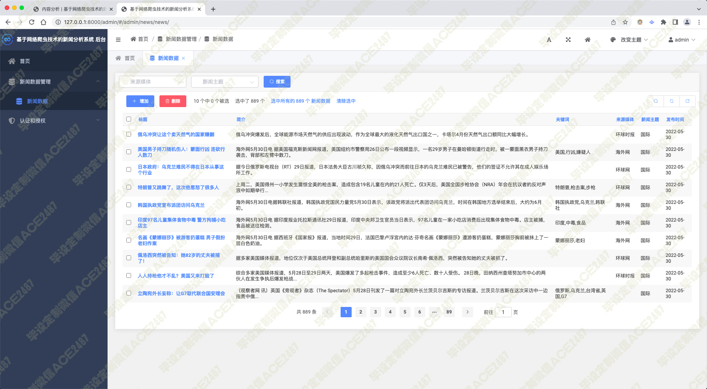
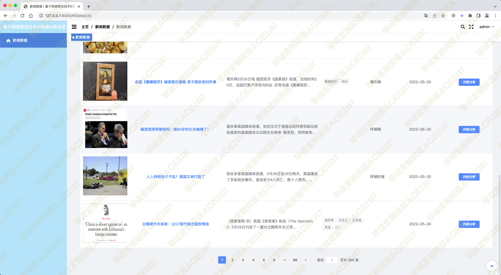
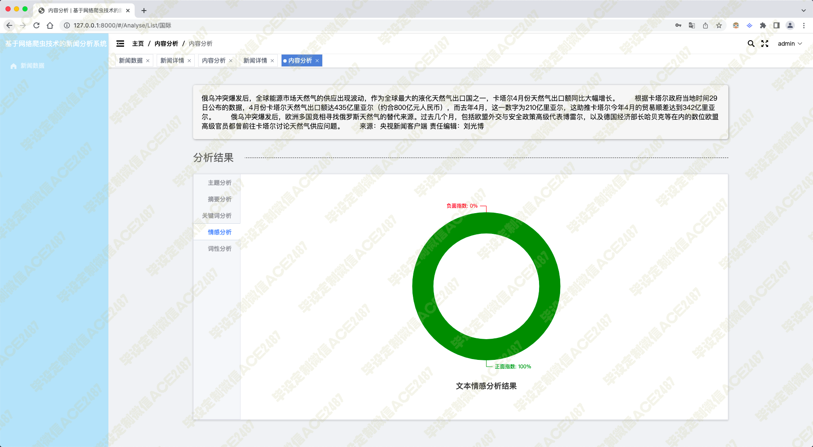
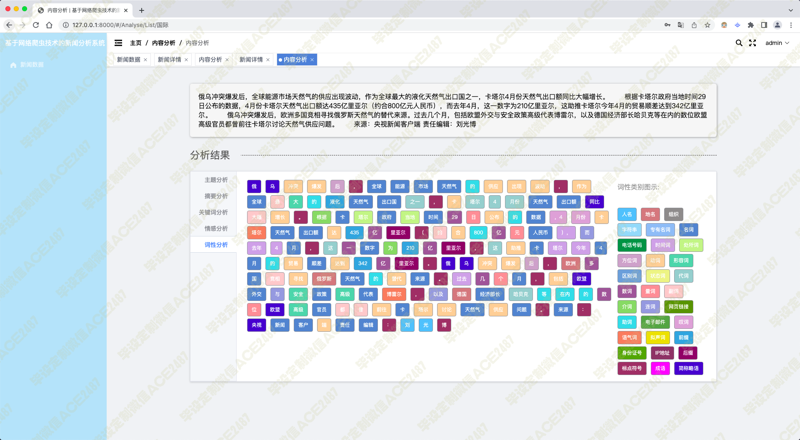
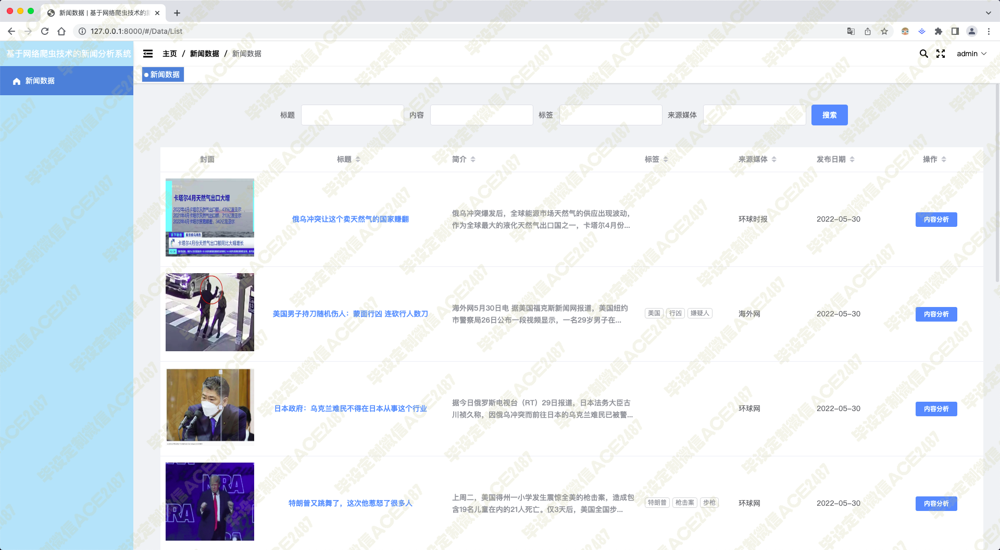
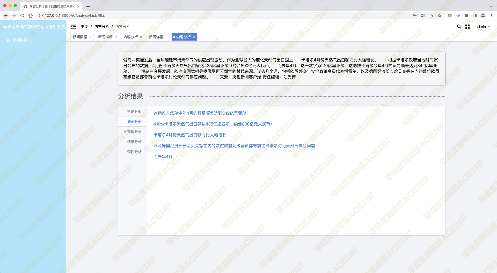
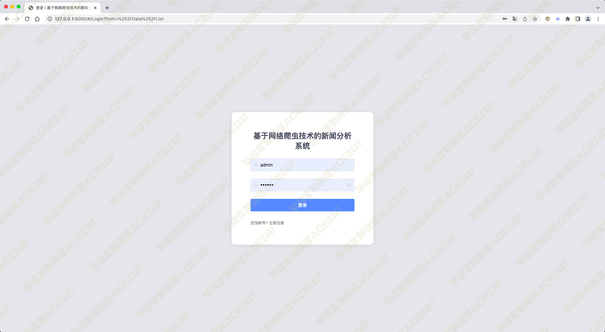

# 007 基于网络爬虫技术的新闻分析系统-毕业设计展示

#### 介绍

> **代码有偿获取 可接受定制 微信联系方式: ACE2487，备注(毕设)**

> 

## 技术栈

python django vue scrapy jieba nlp 爬虫抓取 新闻列表 新闻详情 新闻分类 新闻摘要抽取 关键词分析 情感分析 朴素贝叶斯算法 词性分析 后台管理新闻数据

## 视频

> **点击查看 \>\>\> [https://www.bilibili.com/video/BV1vr4y1x7Aq/](https://www.bilibili.com/video/BV1vr4y1x7Aq/)**

## 截图

